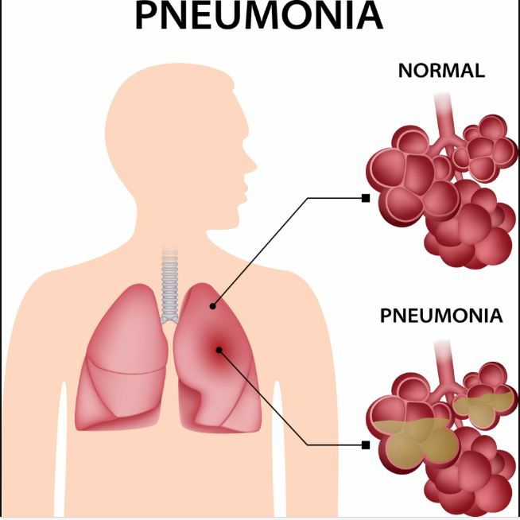
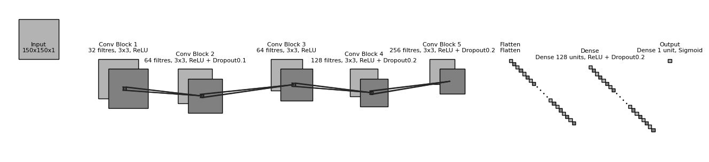

# CNN Pneumonia Detection

## 1. Qu’est-ce que la pneumonie ?
La **pneumonie** est une infection des poumons qui peut être causée par des bactéries, des virus ou des champignons.  
Elle entraîne une **inflammation des alvéoles pulmonaires**, souvent remplies de liquide ou de pus, ce qui rend la respiration difficile.  

---

## 2. Description du projet
Ce projet consiste à construire un modèle de deep learning basé sur un CNN (Convolutional Neural Network) pour détecter la pneumonie à partir d’images radiographiques (chest X-ray). L’objectif est de faire apprendre un modèle CNN dans le cadre de ce projet pour :

- Prédire si une radiographie montre une **pneumonie** ou est **normale**.  
- Visualiser les performances du modèle et comprendre ses prédictions.  

Le dataset utilisé est celui de Kaggle : [Chest X-Ray Images (Pneumonia)](https://www.kaggle.com/datasets/paultimothymooney/chest-xray-pneumonia), qui contient des images classées en deux catégories : **PNEUMONIA** et **NORMAL**.

---

## 3. Préprocessing des données
- Les images sont redimensionnées à **150x150 pixels** et converties en niveaux de gris.  
- Les images sont **normalisées** (valeurs de pixels entre 0 et 1) pour faciliter l’apprentissage.  
- **Data augmentation** est appliquée sur le set d’entraînement pour améliorer la généralisation du modèle :  
  - Rotation aléatoire  
  - Zoom  
  - Flip horizontal  

- Les images sont organisées en **train / validation / test** avec `ImageDataGenerator` de Keras pour gérer l’entrée du CNN.

---

## 4. Architecture du modèle CNN
Le modèle construit comprend :

1. **Couches convolutives (Conv2D)** pour extraire les caractéristiques de l’image (bords, textures, motifs).  
2. **BatchNormalization** pour stabiliser l’entraînement.  
3. **MaxPooling** pour réduire la taille des cartes de caractéristiques et éviter le surapprentissage.  
4. **Dropout** pour régulariser le modèle et réduire l’overfitting.  
5. **Flatten + Dense** pour la classification finale.  
6. **Activation sigmoid** en sortie pour obtenir une probabilité binaire (pneumonia / normal).  

- Optimizer : `RMSprop`  
- Loss : `binary_crossentropy`  
- Metrics : `accuracy`

| Bloc | Couche / Opération | Détails |
|------|------------------|---------|
| Entrée | Input | 150 x 150 x 1 |
| Bloc 1 | Conv2D | 32 filtres, 3x3, ReLU, padding='same' |
|        | BatchNormalization | - |
|        | MaxPooling2D | 2x2, padding='same' |
| Bloc 2 | Conv2D | 64 filtres, 3x3, ReLU, padding='same' |
|        | Dropout | 0.1 |
|        | BatchNormalization | - |
|        | MaxPooling2D | 2x2, padding='same' |
| Bloc 3 | Conv2D | 64 filtres, 3x3, ReLU, padding='same' |
|        | BatchNormalization | - |
|        | MaxPooling2D | 2x2, padding='same' |
| Bloc 4 | Conv2D | 128 filtres, 3x3, ReLU, padding='same' |
|        | Dropout | 0.2 |
|        | BatchNormalization | - |
|        | MaxPooling2D | 2x2, padding='same' |
| Bloc 5 | Conv2D | 256 filtres, 3x3, ReLU, padding='same' |
|        | Dropout | 0.2 |
|        | BatchNormalization | - |
|        | MaxPooling2D | 2x2, padding='same' |
| Bloc final | Flatten | - |
|            | Dense | 128 neurones, ReLU |
|            | Dropout | 0.2 |
|            | Dense | 1 neurone, Sigmoid |
| Sortie | - | Probabilité binaire (Normal / Pneumonia) |

---

## 5. Entraînement
- Le modèle a été entraîné sur **12 epochs** avec batch size = 32.  
- Une **reduction du learning rate** a été appliquée pour améliorer la convergence (`ReduceLROnPlateau`).  
- Les courbes d’**accuracy** et de **loss** sont suivies pour le train et la validation afin de détecter l’overfitting.

---

## 6. Évaluation
- Accuracy finale sur le test set : **~92%**  
- Analyse des performances via :  
  - **Courbes d’accuracy et de loss**  
  - **Confusion matrix**  
  - **Classification report** (precision, recall, f1-score)  
  - Visualisation des **prédictions correctes et incorrectes** pour comprendre où le modèle se trompe.  

---

## 7. Résultats visuels
- Le notebook affiche :  
  1. **Exemples d’images correctement classées**  
  2. **Exemples d’images mal classées**  
  3. **Courbes d’accuracy et de loss**  
  4. **Confusion matrix**  

Cela permet d’analyser concrètement les forces et limites du modèle.
